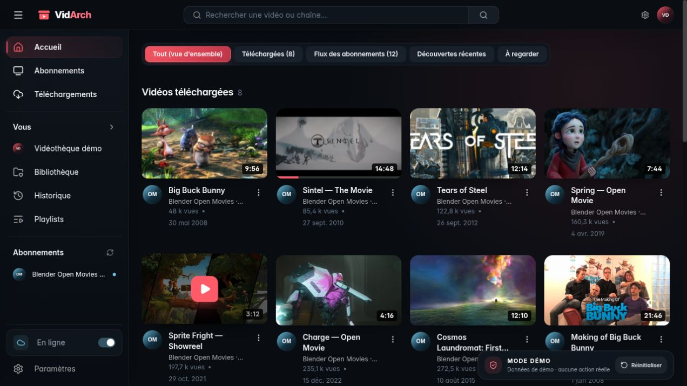
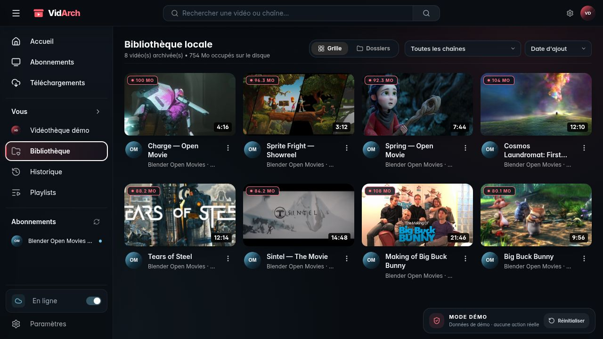

<div align="center">
  
  <h1>VidArch</h1>
  <p><strong>A self-hosted video discovery, download, and library experience built for permanent local ownership.</strong></p>

  <p>
    <a href="https://vidarch.lucas-homelab.fr"><strong>Website</strong></a> ·
    <a href="https://demo.vidarch.lucas-homelab.fr"><strong>Live demo</strong></a> ·
    <a href="https://docs.vidarch.lucas-homelab.fr"><strong>Documentation</strong></a>
  </p>

  <p>
    <a href="https://github.com/lucas-lepajollec/vidarch/pkgs/container/vidarch"></a>
    <a href="LICENSE"></a>
    
  </p>

  
</div>

VidArch keeps familiar video discovery patterns while adding a durable local layer. Browse subscriptions and online results, choose what matters, follow downloads, and return to the same material later from a private library backed by ordinary files and SQLite.

The product is intentionally one experience across online and local use: discovery becomes download, download becomes archived media, and archived media remains browsable even when network-dependent features are unavailable.

## Discovery becomes ownership

| Familiar discovery | Permanent local library |
| --- | --- |
| Follow subscriptions, search, browse channels, and move naturally between online and downloaded material. | Filter archived files, inspect disk usage, organize channel spaces, and play media directly from the server. |
|  |  |

## Highlights

- Unified search across local media, subscriptions, channels, and supported online results.
- Automatic or on-demand archiving with selectable video quality or audio-only output.
- Download queue, progress, history, and subscription checks.
- Physical folder view matching the files stored under `downloads/`.
- Local HTML5 playback with HTTP range requests, seeking, playback speed, theater mode, and picture-in-picture.
- Playlists, viewing history, creator/channel spaces, banners, avatars, and imported local MP4/WebM files.
- Explicit online/local mode rather than a separate reduced application.
- Optional password lock, constrained paths, request throttling, and content-security headers.

VidArch uses `yt-dlp`, FFmpeg, and FFprobe. Supported sources, formats, and metadata behavior can change when third-party sites or tools change; keep the bundled toolchain current and validate important workflows after upgrades.

## Quick start with Docker

```yaml
services:
  vidarch:
    image: ghcr.io/lucas-lepajollec/vidarch:latest
    container_name: vidarch
    restart: unless-stopped
    ports:
      - "127.0.0.1:2499:2499"
    environment:
      PORT: 2499
      NODE_ENV: production
      DATA_DIR: /app/data
      DOWNLOADS_DIR: /app/downloads
      AUTH_PASSWORD: ${AUTH_PASSWORD:-}
    volumes:
      - ./data:/app/data
      - ./downloads:/app/downloads
```

```bash
docker compose up -d
```

Open `http://127.0.0.1:2499`. The default Compose binding is local-only. If you deliberately expose VidArch to a LAN, set a strong `AUTH_PASSWORD`, override `VIDARCH_BIND_ADDRESS`, and use HTTPS when traffic leaves a trusted host.

To build the current checkout instead of using GHCR:

```bash
git clone https://github.com/lucas-lepajollec/vidarch.git
cd vidarch
cp .env.example .env
docker compose up -d --build
```

## Local development

### Requirements

- Node.js 20 or 22.
- Python 3.10+ with a current `yt-dlp` installation.
- FFmpeg and FFprobe available on `PATH`.

```bash
npm ci
npm --prefix client ci
npm run dev
```

The frontend is available on `http://127.0.0.1:2499` and the development API on `http://127.0.0.1:2498`. Both bind locally by default. Use `npm run dev:lan` only for deliberate testing on a trusted network and configure authentication first when other users share that network.

```bash
npm run build
npm test
npm start
```

## Storage and configuration

| Variable | Default | Purpose |
| --- | --- | --- |
| `PORT` | `2498` in development, `2499` in production | Express listening port. |
| `DATA_DIR` | `./data` | SQLite database, session material, and optional `cookies.txt`. |
| `DOWNLOADS_DIR` | `./downloads` | Archived video, thumbnails, and metadata. |
| `YT_DLP_PATH` | Auto-detected | Override the `yt-dlp` executable. |
| `AUTH_PASSWORD` | Unset | Require a password for the UI and API. |
| `SESSION_SECRET` | Generated and persisted | Sign session cookies. |
| `VIDARCH_BIND_ADDRESS` | `127.0.0.1` in Compose | Deliberately change the host network binding. |

Back up `DATA_DIR` and `DOWNLOADS_DIR` together. The database describes the library while the download directory contains the media it references.

## Security and network exposure

- Set `AUTH_PASSWORD` before exposing VidArch beyond localhost.
- Place remote access behind HTTPS and a trusted reverse proxy.
- Keep `cookies.txt`, the SQLite database, session secrets, and downloaded media out of public static paths.
- Do not publish the data or downloads directories through an unrelated file server.
- Review filesystem ownership instead of granting world-writable permissions.
- Treat imported cookies as account credentials and rotate them if exposure is suspected.
- Keep third-party download targets and legal use within the permissions that apply to you.

The server applies Helmet content-security policy, rate limiting, path confinement, restricted remote-image handling, and optional password-based sessions. These controls reduce risk; they do not make an internet-exposed personal media server maintenance-free.

## Architecture

| Layer | Technology |
| --- | --- |
| Frontend | React 19, TypeScript, Vite, Tailwind CSS |
| Backend | Node.js 22, Express 5, TypeScript |
| Persistence | SQLite via `better-sqlite3`, WAL mode |
| Media | `yt-dlp`, FFmpeg, FFprobe |
| Operations | Docker, Docker Compose, GHCR |

```text
vidarch/
├── client/             # React application and isolated demo
├── server/src/         # API, library, download, search, and security logic
├── data/               # Runtime state; keep private and persistent
├── downloads/          # Archived media; keep private and persistent
├── scripts/            # Development and operational helpers
├── Dockerfile
└── docker-compose.yml
```

## Public demo

The [public demo](https://demo.vidarch.lucas-homelab.fr) runs the real interface with a curated Blender Open Movies dataset. Actions and counters are simulated in the browser, external services are disabled, and the state resets. Artwork comes from Blender Studio projects released under Creative Commons licenses; attribution is included in the corresponding demo entries.

The demo is a safe product walkthrough. It is not connected to a private library, cookies file, downloader, or personal account.

## Legal notice

VidArch is an independent open-source project for personal archiving, offline viewing, and other lawful uses. It is not affiliated with, endorsed by, or sponsored by Google LLC or YouTube LLC. YouTube is a trademark of Google LLC; other names and marks belong to their respective owners.

You are responsible for complying with applicable copyright law, licenses, third-party terms, and access restrictions. The presence of a technical download path does not grant permission to copy or redistribute content.

## Contributing and license

Contributions, bug reports, and feature requests are welcome. Read [CONTRIBUTING.md](CONTRIBUTING.md), [CODE_OF_CONDUCT.md](CODE_OF_CONDUCT.md), and [SECURITY.md](SECURITY.md) before participating.

VidArch is distributed under the [MIT License](LICENSE). Third-party tools and demo media retain their own licenses.
